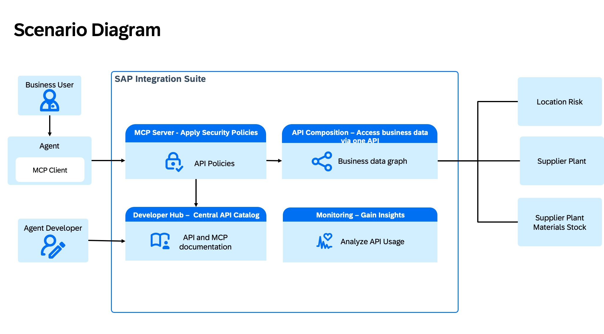

# Expose Composed APIs as MCP Server using SAP Integration Suite MCP Gateway

## Description
This hands-on session demonstrates how **SAP Integration Suite** supports agentic AI scenarios by using **MCP Gateway** functionality to expose composed business APIs as **Model Context Protocol (MCP) tools**. _This approach gives AI agents standardized, secure, and governed access to enterprise context._

Through the exercises, you will combine multiple backend APIs into a unified Business Data Graph, package it as an MCP Server, and test it using MCP Client

## Requirements
There are no dedicated requirements for this session. You would be able to execute the exercises by just following the descriptions even if you do not have any experience with **SAP Integration Suite** and the **Model Context Protocol (MCP)**.

However, you will be able to derive more value from this session if you have some knowledge and understanding of Model Context Protocol (MCP) along with SAP Integration Suite, API Management and API Composition capabilities.

To get started and build expertise with the technologies used in this workshop, explore the following resources:

- [SAP Integration Suite](https://discovery-center.cloud.sap/serviceCatalog/integration-suite?region=all)
- [Model Context Protocol (MCP)](https://modelcontextprotocol.io/docs/2026-07-28/getting-started/intro)

## Session Overview

### Business Scenario
**BestRun** receives a procurement request: "Source 500 units of Material M-4821 for delivery to Hamburg, Germany."

Multiple suppliers offer this material from plants in different locations. The agent must evaluate each option and recommend the optimal supplier — balancing risk exposure, stock availability, and logistics distance.
The company **BestRun** wants to optimize their procurement process by establishing a Risk Assessment Process using an AI Agent.

**Goal:** Select most reliable supplier for each material taking into consideration the risk associated with a location of the plant, stock levels of the material at a plant and physical distance of the plant from delivery location.

**Data Sources:**
| Source | Content |
|---|---|
| Business Partner API | Supplier details |
| Risk Analytics API | Third party API (e.g. Everstream system) that exposes risk associated with a location |
| Plant API | Plant details |
| Material API | Material, Storage location, stock levels, and batch details |

**Solution:** In this hands-on session, you will build and configure an MCP Server that exposes a composed API as a tool, enabling AI agents to automate supplier selection within Best Run’s procurement process securely and with proper governance, without compromising business context. The agent dynamically evaluates multiple risk dimensions—including geopolitical and environmental risks at the plant location, available stock levels, and physical proximity to the delivery point—to recommend the most reliable supplier for a given material request.

Creation of AI agent is not part of this hands-on, it mainly includes the following:

- Combining multiple backend system APIs into a single composed API using the API Composition capability of SAP Integration Suite
- Creating and exposing an MCP server with the composed API as a tool in SAP Integration Suite, enabling an AI agent to automate supplier selection within Best Run’s procurement process securely and with proper governance, without compromising business context
- Testing the MCP server using MCP client

> [!NOTE]
> All these APIs are mock APIs publicly hosted for hands-on session

## Pre-configured Setup
Chapters in this section provide pre-configured setups to support learning, without being part of the hands-on exercises:

- [SAP BTP Destinations Setup (for your information only)](tutorials/composed-mcp-server/pre-configured/SAP_BTP_Destinations_Setup/README.md)
  
## System URL and login information
To complete the exercises, the instructors will provide the following system URL and access:

- **SAP Integration Suite**
- **MCP Inspector** (MCP Client)

> [!IMPORTANT]
> - _For a smooth experience, tenants have been preconfigured, and you already have all the roles and permissions needed to complete this exercise._
> - _System details along with User ID and password information will be provided to you by the instructors._
> - _When you run through the exercise steps, you need to ensure that the technical IDs of the integration artifacts that you will create are unique. Hence, add a participant number to your integration artifacts. The instructors will assign the participant number to you._
> - _Please adhere strictly to the instructions regarding the naming conventions for the artifacts you create. This will ensure successful completion of the tasks without conflicting with other participants._
> - _Do not delete, change or undeploy any artifact in the tenant other than yours._

## Exercises
The complete list of exercise steps are listed below, run through them in the given order.

- [Exercise 1 - Build a Unified Supply Risk API with Business Data Graph](tutorials/composed-mcp-server/exercises/ex1/README.md)
- [Exercise 2 - Create, Deploy & Consume an MCP Server using SAP Integration Suite](tutorials/composed-mcp-server/exercises/ex2/README.md)

## Feedback
We appreciate your feedback after the session!

## Code of Conduct
Please read the [SAP Open Source Code of Conduct](https://github.com/SAP-samples/.github/blob/main/CODE_OF_CONDUCT.md).

## How to Obtain Support
Support for the content in this repository is available during the actual time of the session for which this content has been designed.
Otherwise, [Create an issue](https://github.com/SAP-samples/<repository-name>/issues) in this repository if you find a bug or have questions about the content.
 
For additional support, [ask a question in SAP Community](https://answers.sap.com/questions/ask.html).

## Contributing
If you wish to contribute code, offer fixes or improvements, please send a pull request. Due to legal reasons, contributors will be asked to accept a DCO when they create the first pull request to this project. This happens in an automated fashion during the submission process. SAP uses [the standard DCO text of the Linux Foundation](https://developercertificate.org/).

## License
Copyright 2026 SAP SE or an SAP affiliate company and integration-mcp-gateway contributors. Please see our [LICENSE](LICENSE) for copyright and license information. Detailed information including third-party components and their licensing/copyright information is available [via the REUSE tool](https://api.reuse.software/info/github.com/SAP-samples/integration-mcp-gateway).
