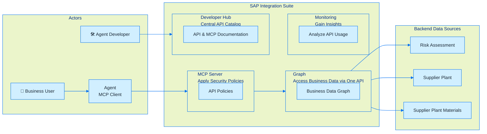

# MCP Gateway using Composed API — Hands-On Workshop

## Overview

This tutorial walks you through building an AI-ready enterprise API using **SAP Integration Suite**. You will compose multiple backend data sources into a unified **Business Data Graph**, expose it as a **Model Context Protocol (MCP) Server**, and connect it to an AI agent — all within a governed, policy-enforced runtime.

By the end, you will have a fully functional MCP endpoint that an AI agent can call to answer real procurement questions about plant risk, supplier reliability, and material stock levels.

---

## Scenario

**Company:** BestRun

**Challenge:** BestRun wants to optimize procurement by selecting the most reliable supplier for each material — factoring in the risk associated with the supplier's plant location, current stock levels, and physical distance from the delivery point.

**Data Sources:**

| Source | Content |
|---|---|
| Business Partner API | Supplier details |
| Risk Analytics API | Location risk data (Everstream mock) |
| Plant API | Plant details |
| Material API | Material, storage location, stock levels, and batch details |

**Goal:** Give an AI agent a single, governed API endpoint that surfaces composed supply risk data — so it can reason across all four data sources in a single query.

---

## Architecture

---

## Component Roles

| Component | Role |
|---|---|
| **Agent / MCP Client** | AI agent (e.g. MCP Inspector, Claude, Joule) that calls MCP tools to answer user questions |
| **MCP Server** | Exposes the Business Data Graph API as MCP tools; enforces authentication and authorization policies |
| **Developer Hub** | Central catalog where agents discover, subscribe to, and obtain credentials for MCP products |
| **Business Data Graph** | Unified OData API composing Risk, Plant, Material, and Supplier data into a single endpoint |
| **Monitoring** | Tracks API usage, latency, and errors across the deployed MCP Server |
| **Backend Data Sources** | Mock S/4HANA and Everstream APIs providing the underlying plant, stock, and risk data |

---

## What You Will Build

| Exercise | What you do |
|---|---|
| [Exercise 1 — Build a Unified Supply Risk API](exercises/ex1/README.md) | Create a Business Data Graph composing four backend APIs, define a Custom Entity (`bestrun.assessment`) joining Plant, AddressRisk, and MaterialStock, and activate the graph to produce a unified OData endpoint and OpenAPI Specification |
| [Exercise 2 — Create, Deploy & Consume an MCP Server](exercises/ex2/README.md) | Wrap the Business Data Graph as an MCP Server artifact, review and understand the default policy model, deploy to Integration Cell, publish via Developer Hub, subscribe, and test the live tools with MCP Inspector |

---

## Further Reading

- [SAP Help: API Composition](https://help.sap.com/docs/api-composition/isuite-api-composition/what-is-api-composition?locale=en-US)
- [Model Context Protocol — Introduction](https://modelcontextprotocol.io/docs/2026-07-28/getting-started/intro)
- [API-Centric Integration in SAP Integration Suite](https://community.sap.com/t5/technology-blog-posts-by-sap/api-centric-integration-in-sap-integration-suite-a-new-paradigm-for-api-amp/ba-p/14438245)

---

[Back to Repository Overview](README.md)
