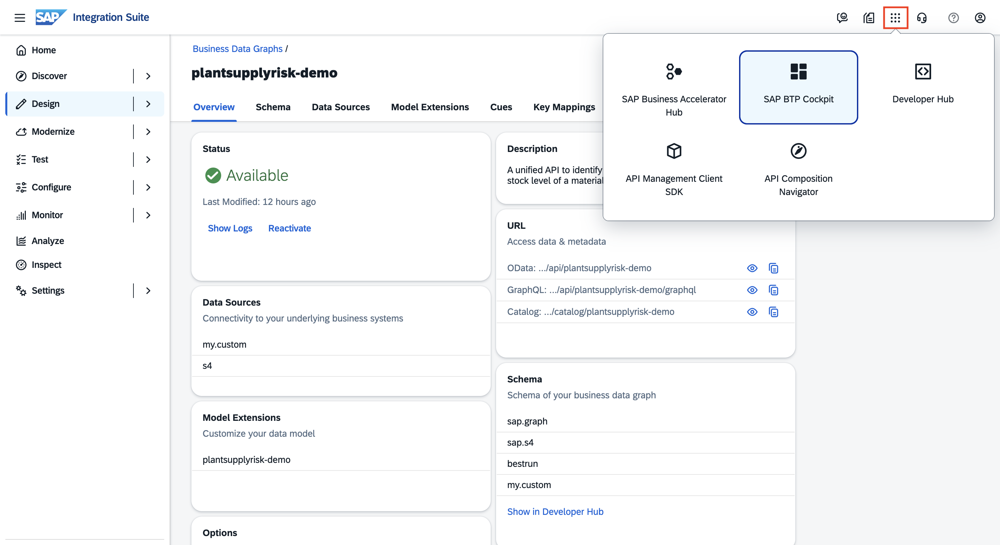
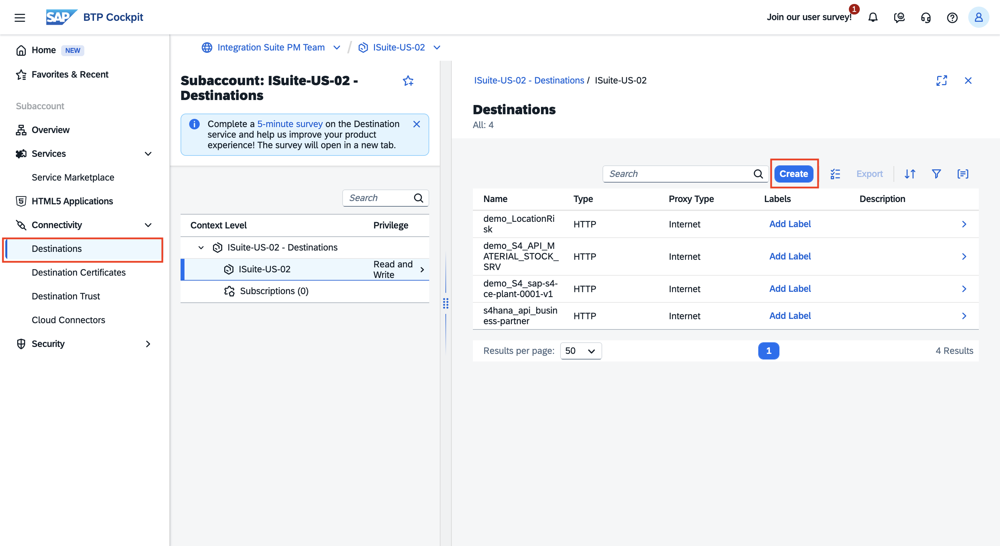
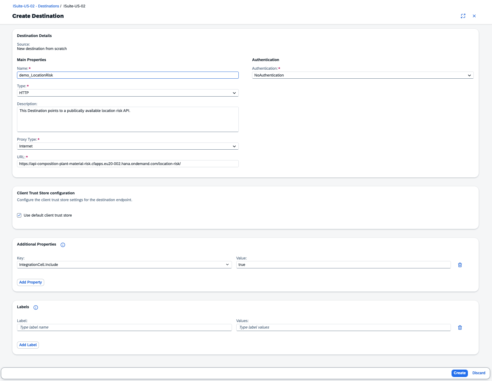

# API Composition Tenant Setup

> **Note:** The following setup has been pre-configured by the session instructors. No action is required from participants.

---

## Prerequisites

- An SAP BTP subaccount in the Cloud Foundry environment with Cloud Foundry enabled
- **SAP Integration Suite** entitled, subscribed, and the `Integration_Provisioner` role collection assigned
- **API Composition** activated on the SAP Integration Suite home page and `Graph.KeyUser` role collection assigned

For reference on how the tenant was set up, see:

- [Check BTP regions where the API Composition capability is available](https://me.sap.com/notes/3338820)
- [Create an SAP BTP Trial Account](https://developers.sap.com/tutorials/hcp-create-trial-account.html)
- [Set up SAP Integration Suite on Trial](https://developers.sap.com/tutorials/cp-starter-isuite-onboard-subscribe.html)
- [Activate API Composition on SAP Integration Suite](https://help.sap.com/docs/api-composition/isuite-api-composition/initial-setup?locale=en-US#2.-activate-api-composition-on-sap-integration-suite)

Refer to the [API Composition Initial Setup](https://help.sap.com/docs/api-composition/isuite-api-composition/initial-setup) guide for full details.

---

## Destinations

Four HTTP destinations are configured in the SAP BTP subaccount, each pointing to one of the publicly hosted mock APIs at `https://api-composition-plant-material-risk.cfapps.eu20-002.hana.ondemand.com`.

| Destination | Path | Represents |
| :--- | :--- | :--- |
| `demo_LocationRisk` | `/location-risk` | Location risk data (Everstream mock) |
| `demo_S4_API_MATERIAL_STOCK_SRV` | `/material-stock` | Material stock levels (S/4HANA mock) |
| `demo_S4_sap-s4-ce-plant-0001-v1` | `/plant` | Plant details (S/4HANA mock) |
| `s4hana_api_business-partner` | `/business-partner` | Supplier / Business Partner data |

In the BTP Cockpit, navigate to **Connectivity → Destinations** to view the configured destinations.

Each destination is configured with the following fields:

| Field | Value |
| :--- | :--- |
| Name | *(destination name from the table above)* |
| Type | **`HTTP`** |
| Proxy Type | **`Internet`** |
| URL | *(corresponding URL from the table above)* |
| Authentication | **`NoAuthentication`** |

Under **Additional Properties**:

| Key | Value |
| :--- | :--- |
| `IntegrationCell.Include` | **`true`** |

> The `IntegrationCell.Include = true` additional property makes the destination visible in the Integration Cell runtime.
