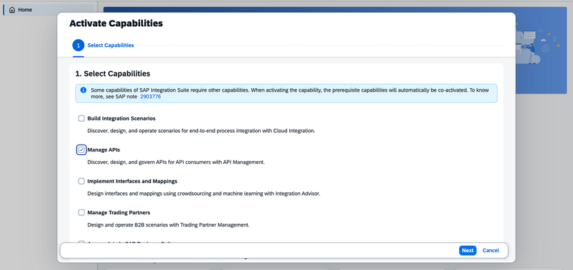
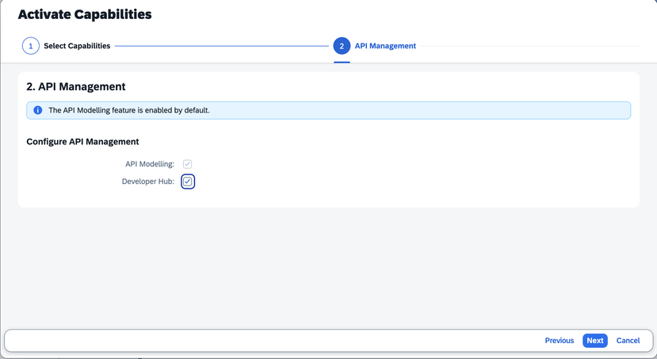
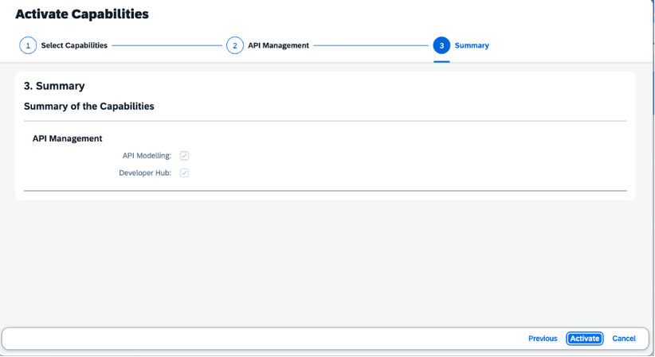
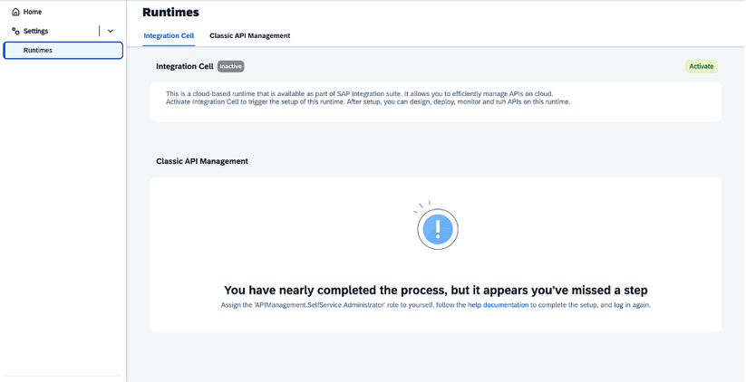
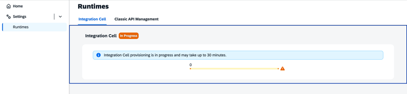
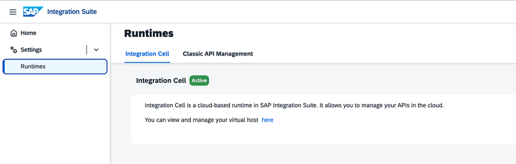

# MCP Gateway Tenant Setup

> **Note:** The following setup has been pre-configured by the session instructors. No action is required from participants.

---

## Prerequisites

- **SAP Integration Suite** provisioned with the `Integration_Provisioner` role collection assigned
- The MCP Server artifact is available only on the **Enhanced**, **Premium**, **Trial**, and **Free Tier** service plans for SAP Integration Suite
- The `PI_Integration_Developer` role collection is assigned

---

## API Management Capability

To design and deploy API Artifacts to Integration Cell, the API Management capability is activated via **SAP Integration Suite → Home → Manage Capabilities**.

In the **Select Capabilities** step, **Manage APIs** is selected.

In the **API Management** configuration step:

- **API Modelling** is selected by default
- **Developer Hub** is enabled for API discovery and consumption

After reviewing the selected capabilities in the **Summary** step, **Activate** is chosen.

Once activation is complete, API Modelling is available for designing API Artifacts and Developer Hub is available for API discovery and consumption.

---

## Integration Cell Runtime

The Integration Cell runtime is activated via **SAP Integration Suite → Settings → Runtimes → Integration Cell**.

> Integration Cell is a fully managed runtime — no Kubernetes cluster or infrastructure configuration is required. The underlying runtime environment is provisioned and managed by SAP.

After activation, the runtime status shows as **Active**.

The `PI_Integration_Developer` role collection is assigned, providing the required access to design and deploy API Artifacts to Integration Cell.

> For a detailed walkthrough, refer to [API-Centric Integration on SAP Integration Suite — Part 1](https://community.sap.com/t5/technology-blog-posts-by-sap/api-centric-integration-on-sap-integration-suite-part-1-build-and-deploy/ba-p/14438357).
