# Exercise 1 — Build a Unified Supply Risk API with Business Data Graph

## Overview

In this exercise, you will use API Composition to compose supplier, plant, stock, and location risk data into a single unified API.
By the end, you will have an OData endpoint and an OpenAPI Specification ready for the MCP Server in [Exercise 2 — Create, Deploy & Consume an MCP Server](../ex2/README.md).

> For a deeper understanding of the capability, refer to [SAP Help: API Composition](https://help.sap.com/docs/api-composition/isuite-api-composition/what-is-api-composition?locale=en-US)

---

> [!IMPORTANT]
> Add your participant number to the end of every artifact you create. Wherever you see `XX` in the steps below, replace it with your assigned number (e.g. participant `03` uses `plantsupplyrisk-demo-XX-03`).

## Ex. 1.1 — Create a New Business Data Graph

### Step 1 — Navigate to Business Data Graphs

In SAP Integration Suite, go to **Design → Business Data Graphs**.

You will either see a list of existing graphs on the tenant, or an empty state with a Create button at the center of the page if none exist yet.

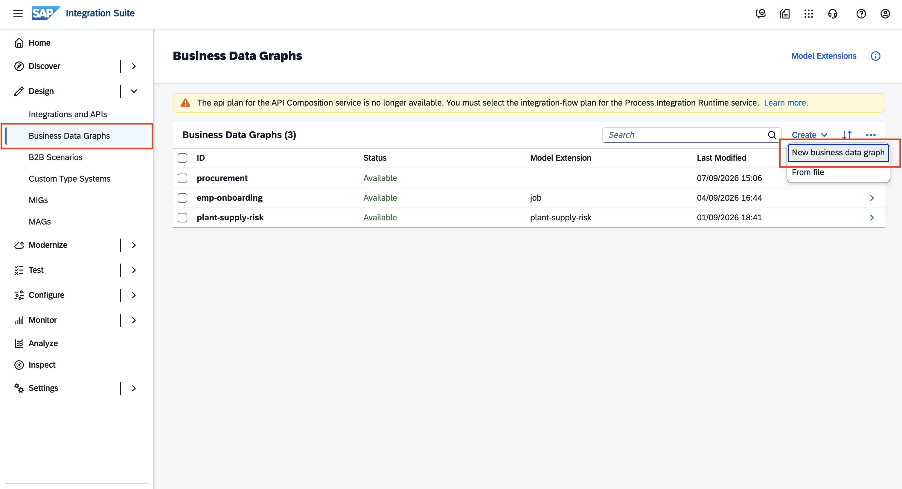

Click **Create → New business data graph**.

### Step 2 — Fill in Details and Select Destinations

Fill in the details in the creation dialog:

| Field | Value |
|---|---|
| ID | `plantsupplyrisk-demo-XX` |
| Description | `A unified API to identify risk associated with vendor location and stock level of a material in a plant.` |

Under **Data Source Destinations**, select the following 4 destinations:

- `demo_LocationRisk`
- `demo_S4_API_MATERIAL_STOCK_SRV`
- `demo_S4_sap-s4-ce-plant-0001-v1`
- `s4hana_api_business-partner`

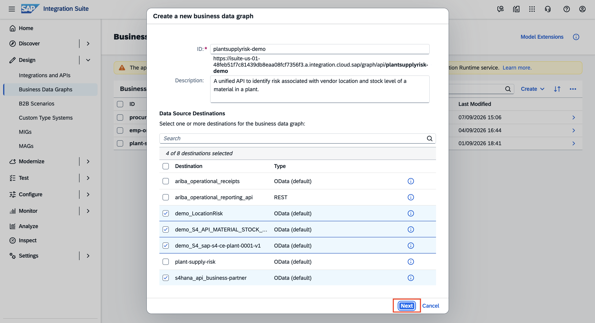

Click **Next**.

---

## Ex. 1.2 — Configure, Analyze and Review

### Step 1 — Configure Model Extension & Options

On the **Model Extension** screen:

- **Model Extension:** Leave as *Select a Model Extension* (skip for now — you will create and link the Model Extension in Ex. 1.4–1.6)
- **OData Containment:** Keep **Enable OData Containment** checked

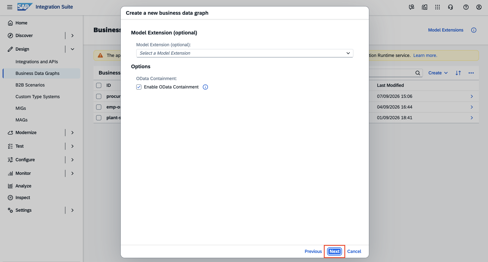

Click **Next**.

### Step 2 — Analyze Landscape

SAP Integration Suite will now connect to each selected destination and analyze the data landscape in the background. This takes a short moment.

Wait until all destinations show a green **Success** status:

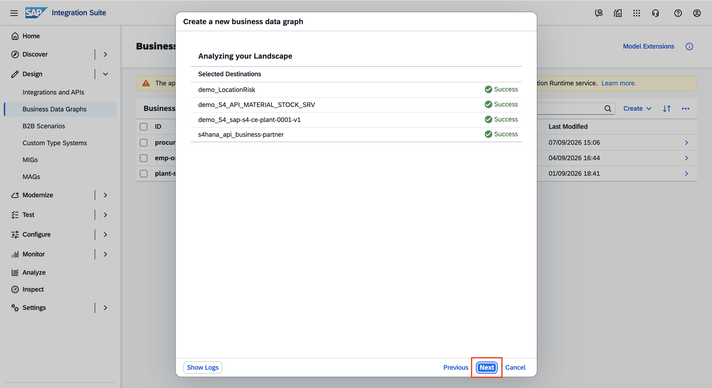

Click **Next**. Once the next page loads, click **Done**.

### Step 3 — Review the Draft

You will land on the **Overview** page of your newly created Business Data Graph, which is currently in **Draft** status.

Review the details:

- **Data Sources:** `my.custom`, `s4`
- **Schema:** `sap.graph`, `sap.s4`, `my.custom`
- **Options:** OData Containment enabled

> [!NOTE]
> The `bestrun` namespace will appear in the Schema after you link the Model Extension and re-activate the Business Data Graph in Ex. 1.6.

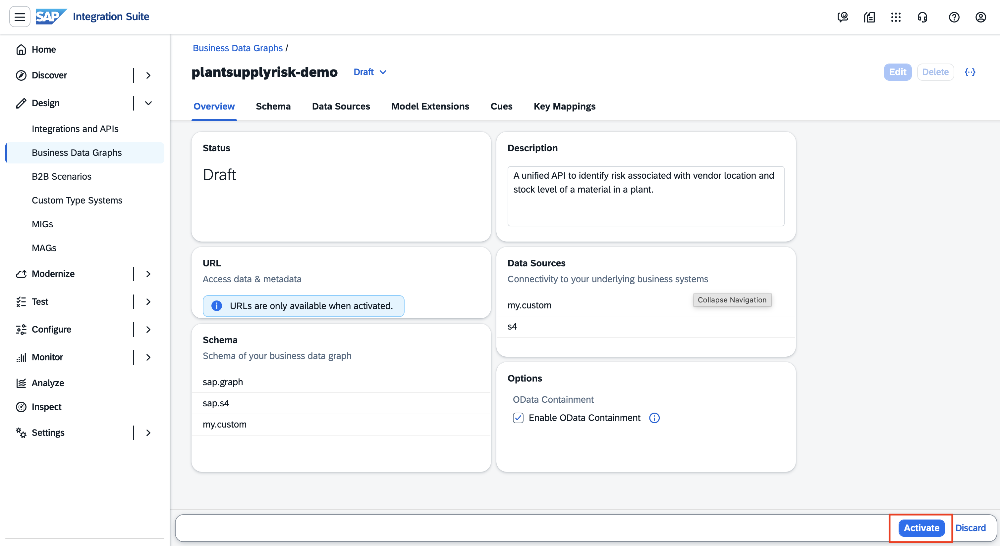

---

## Ex. 1.3 — Activate the Business Data Graph

Click **Activate** at the bottom of the page.

The system will activate the graph and the status will change to **Available**.

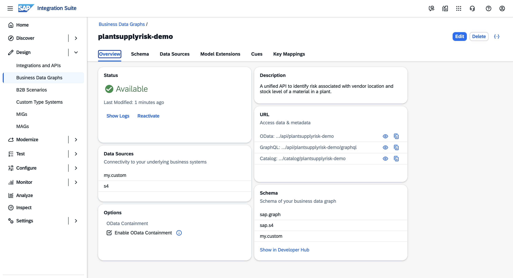

Once activated, the Overview page shows the generated URLs:

| URL Type | Use |
|---|---|
| **OData** | Primary endpoint for data access |
| **GraphQL** | For GraphQL-based consumers |
| **Catalog** | Metadata discovery |

Your graph now appears in **Design → Business Data Graphs** with status **Available**.

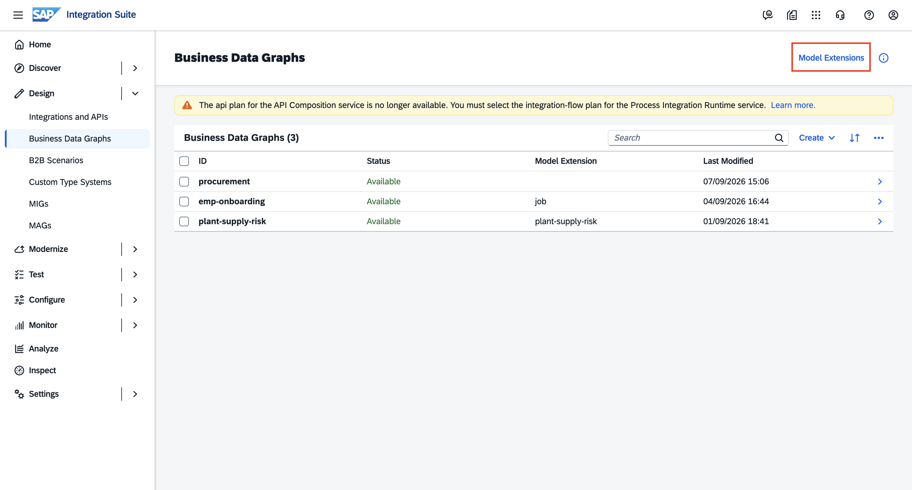

> [!NOTE]
> You will copy the final OData URL after re-activating the Business Data Graph with the Model Extension in Ex. 1.6. That is the URL to use in your MCP Server configuration.

---

## Ex. 1.4 — Create a Model Extension

A **Model Extension** allows you to extend or customize the schema of your Business Data Graph.

### Step 1 — Navigate to Model Extensions

From the **Business Data Graphs** page, click **Model Extensions** (top-right).

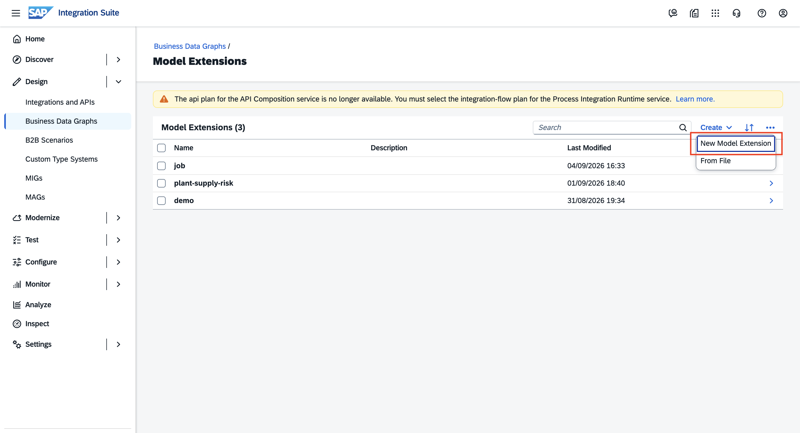

Click **Create → New Model Extension**.

### Step 2 — Fill in Details

Fill in the details:

| Field | Value |
|---|---|
| Name | `plantsupplyrisk-demo-XX` |
| Description | `A unified Model to identify the risk associated with vendor location and stock level of a material in a plant.` |
| Use metadata from business data graph | Select your newly created graph (e.g. `plantsupplyrisk-demo-XX`) |

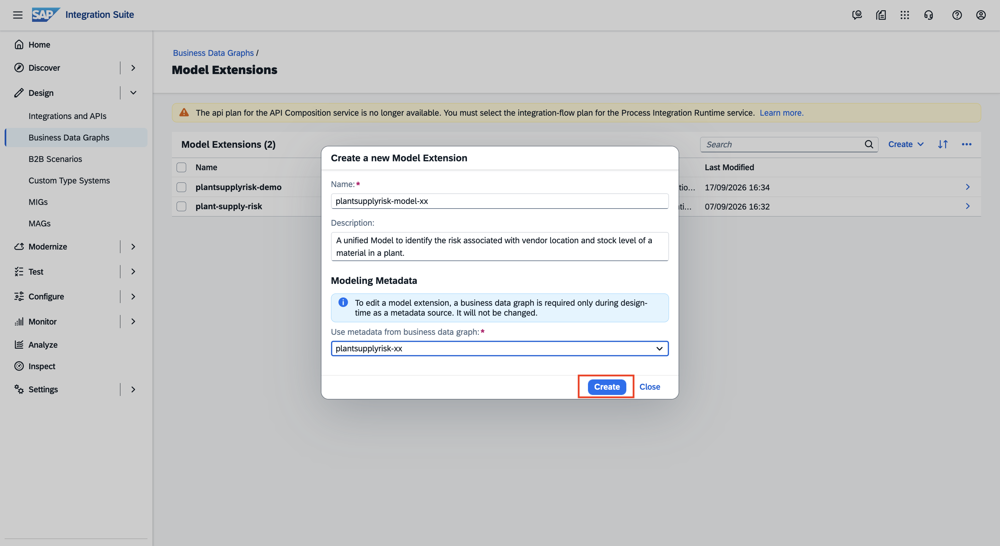

Click **Create**.

---

## Ex. 1.5 — Create a Custom Entity

From the Model Extension detail page, click the **Custom Entities** tab.

You will see an empty state. Click **Create a custom entity**.

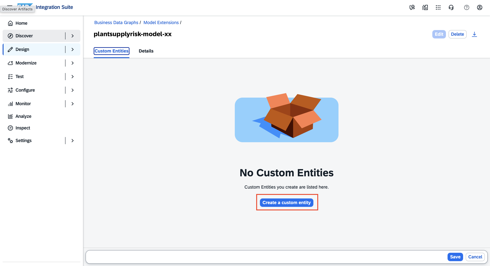

### Step 1 — Name

Fill in the details for the custom entity:

| Field | Value |
|---|---|
| Name | `bestrun.assessment` |
| Label | *(leave empty)* |
| Description | `this custom entity defines the relationship between our backend APIs` |
| Read-only Custom Entity | *(unchecked)* |

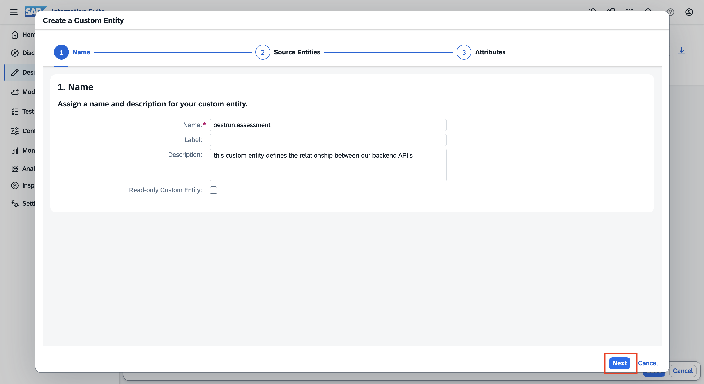

Click **Next**.

### Step 2 — Source Entities

Set the **Main Source Entity** to `my.custom.Plant`.

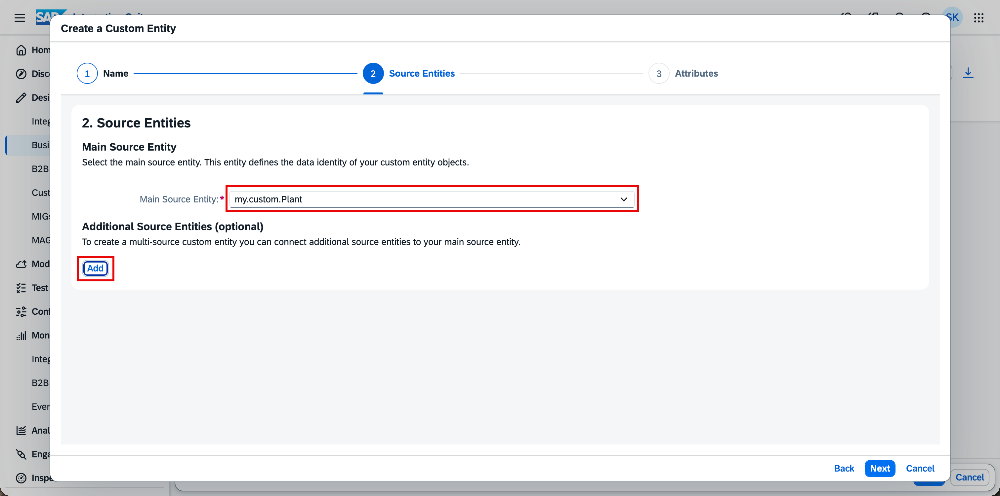

Then click **Add** under **Additional Source Entities** and configure each additional source as follows:

**Additional Source Entity 1:**

| Field | Value |
|---|---|
| Additional Source Entity | `my.custom.AddressRisk` |
| Main Source Attribute | `AddressId` |
| Additional Source Attribute | `AddressId (key)` |
| Cardinality | `many` |
| Composition Attribute | `addressRisks` |

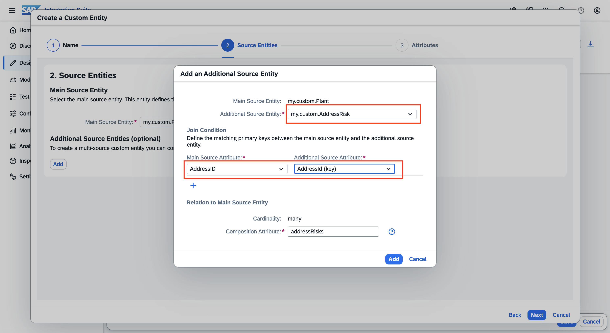

**Additional Source Entity 2:**

| Field | Value |
|---|---|
| Additional Source Entity | `sap.s4.A_MatlStkInAcctMod` |
| Main Source Attribute | `Plant (key)` |
| Additional Source Attribute | `Plant (key)` |
| Cardinality | `many` |
| Composition Attribute | `matlStkInAcctMods` |

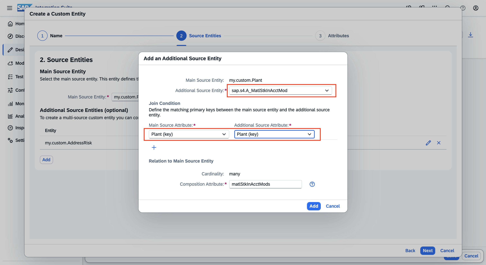

Both additional sources are now listed. Click **Next**.

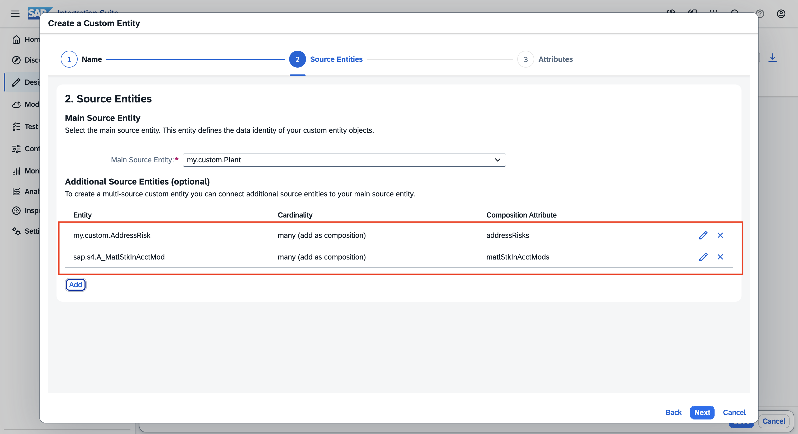

### Step 3 — Attributes

Select the attributes from each source entity as shown below. Use the **Add as** column to rename the attribute in the custom entity's schema.

**my.custom.Plant** *(Main Source Entity)*

| Attribute | Constraint | Data Type | Select | Add as |
|---|---|---|---|---|
| Plant | key | String(4) | ✓ | `id` |
| PlantName | | String(30) | ✓ | `plantName` |
| ValuationArea | | String(4) | | |
| PlantCustomer | | String(10) | | |
| PlantSupplier | | String(10) | | |
| FactoryCalendar | | String(2) | | |
| DefaultPurchasingOrganization | | String(4) | | |
| SalesOrganization | | String(4) | | |
| AddressID | | String(10) | | |
| PlantCategory | | String(1) | | |
| DistributionChannel | | String(2) | | |
| Division | | String(2) | | |
| Language | | String(2) | | |
| IsMarkedForArchiving | | Boolean | | |


**my.custom.AddressRisk** *(many — composition name: `addressRisks`)*

| Attribute | Constraint | Data Type | Select | Add as |
|---|---|---|---|---|
| AddressId | key | String | ✓ | `addressId` |
| RiskFactor | key | String | ✓ | `riskFactor` |
| RiskCategory | | String | ✓ | `riskCategory` |
| RiskScore | | String | ✓ | `riskScore` |
| RiskTrend | | String | ✓ | `riskTrend` |
| RiskScope | | String | ✓ | `riskScope` |


**sap.s4.A_MatlStkInAcctMod** *(many — composition name: `matlStkInAcctMods`)*

| Attribute | Constraint | Data Type | Select | Add as |
|---|---|---|---|---|
| Material | key | String(40) | ✓ | `material` |
| Plant | key | String(4) | | |
| StorageLocation | key | String(4) | ✓ | `storageLocation` |
| Batch | key | String(10) | ✓ | `batch` |
| Supplier | key | String(10) | ✓ | `supplier` |
| Customer | key | String(10) | ✓ | `customer` |
| WBSElementInternalID | key | String(8) | ✓ | `wbsElementInternalID` |
| SDDocument | key | String(10) | ✓ | `sdDocument` |
| SDDocumentItem | key | String(6) | ✓ | `sdDocumentItem` |
| InventorySpecialStockType | key | String(1) | ✓ | `inventorySpecialStockType` |
| InventoryStockType | key | String(2) | ✓ | `inventoryStockType` |
| WBSElementExternalID | | String(24) | | |
| MaterialBaseUnit | | String(3) | | |
| MatlWrhsStkQtyInMatlBaseUnit | | Decimal(14,31) | ✓ | `matlWrhsStkQtyInMatlBaseUnit` |


Click **Create**.

> [!NOTE]
> The attributes selected above and the join conditions reflect the specific fields relevant to this workshop's plant supply risk use case — plant identification, address-level risk scores, and material stock levels. In a real implementation, practitioners should select attributes based on their own business requirements and the fields their consumers actually need.

### Step 4 — Apply the Custom Entity

After clicking **Create**, you will land on the **Custom Entity detail page** showing the composed attribute structure:

| Name | Constraint | Data Type | Cardinality | Transform |
|---|---|---|---|---|
| id | key | String | | |
| plantName | | String | | |
| addressRisks | | Composition | 0 to many | join |
| matlStkInAcctMods | | Composition | 0 to many | join |

Click **Apply** to confirm the custom entity.

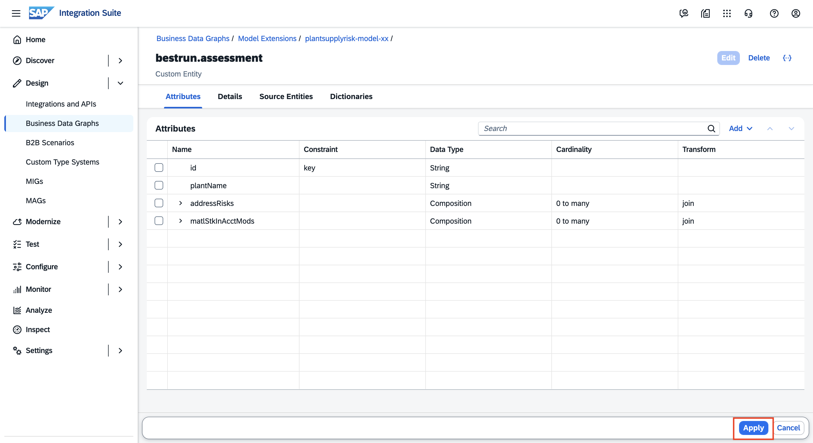

### Step 5 — Save the Model Extension

You will be returned to the **Model Extensions** page where `bestrun.assessment` now appears in the **Custom Entities** list with:

- **Main Source:** `my.custom.Plant`
- **Additional Sources:** `my.custom.AddressRisk`, `sap.s4.A_MatlStkInAcctMod`

Click **Save** to persist the Model Extension.

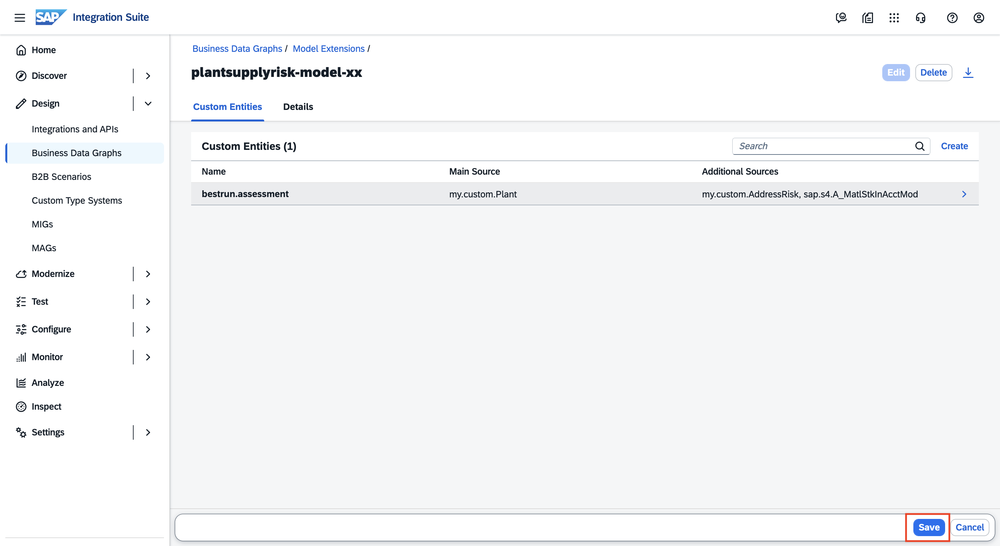

---

## Ex. 1.6 — Connect the Model Extension to the Business Data Graph

After saving the Model Extension, you need to link it back to your Business Data Graph so the custom entity becomes part of the activated API.

### Step 1 — Navigate back to the Business Data Graph

Navigate to **Design → Business Data Graphs**.

Your graph `plantsupplyrisk-demo-XX` will appear in the list with status **Available**. Click on it to open it.

> [!NOTE]
> After opening, the graph status changes to **Draft**. This happens because linking a Model Extension is a configuration change that requires a fresh activation cycle.

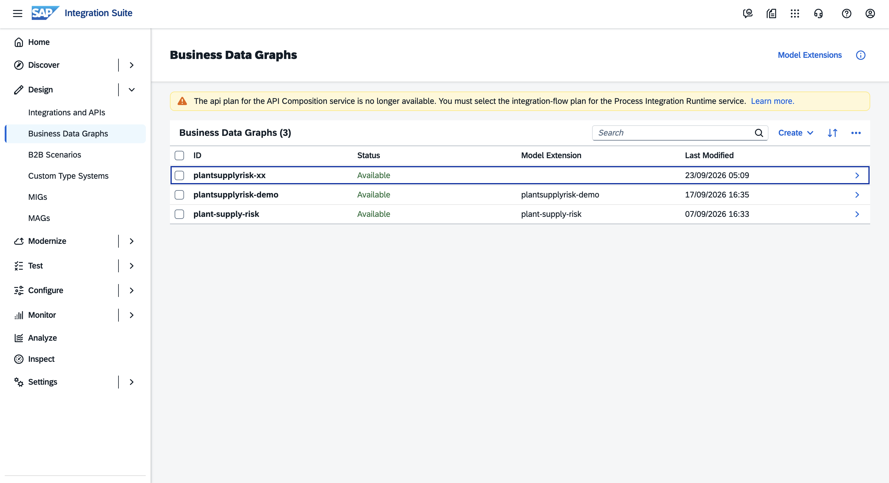

### Step 2 — Add the Model Extension

Click the **Model Extensions** tab. You will see an empty state — **No model extensions defined**.

Click on **Edit**.

Click **Add a Model Extension**.

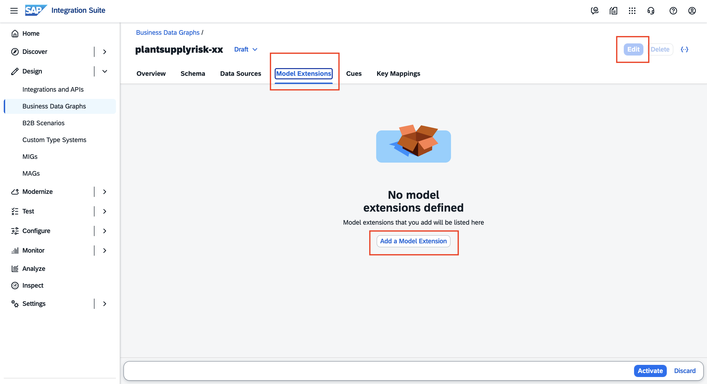

In the **Edit Model Extensions** dialog, select your model extension (e.g. `plantsupplyrisk-demo-XX`) by checking the checkbox next to it.

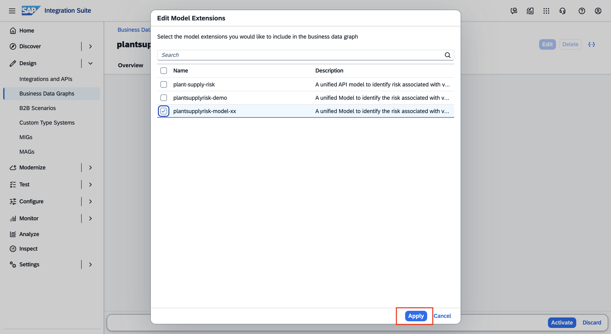

Click **Apply**.

You can verify the custom entity was saved by navigating to **Design → Business Data Graphs → Model Extensions → `plantsupplyrisk-demo-XX`** and opening the **Custom Entities** tab — `bestrun.assessment` should appear there with its Main Source and Additional Sources listed.

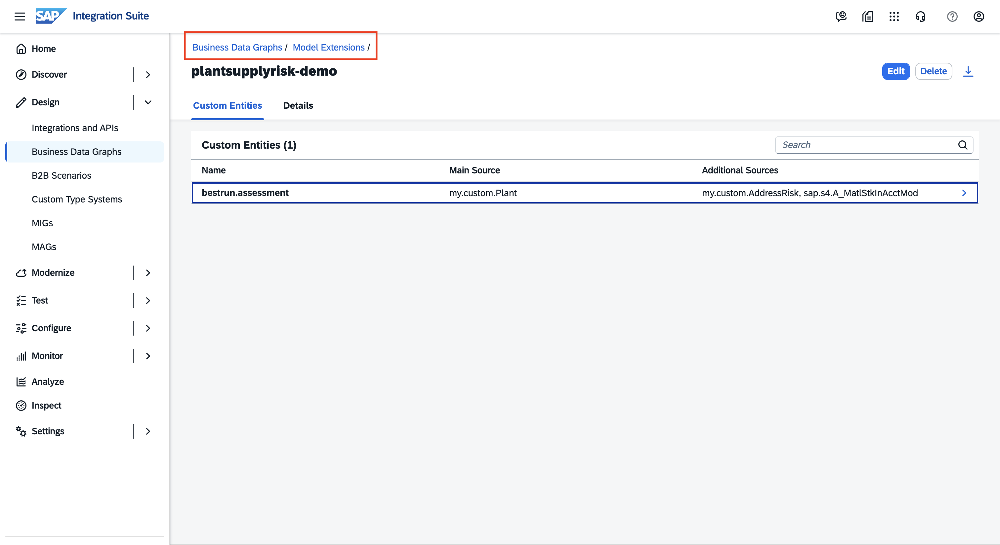

### Step 3 — Activate

Click **Activate** at the bottom of the page.

The status will return to **Available** and the `bestrun` namespace will now appear in the Schema — confirming that `bestrun.assessment` is part of the Business Data Graph.

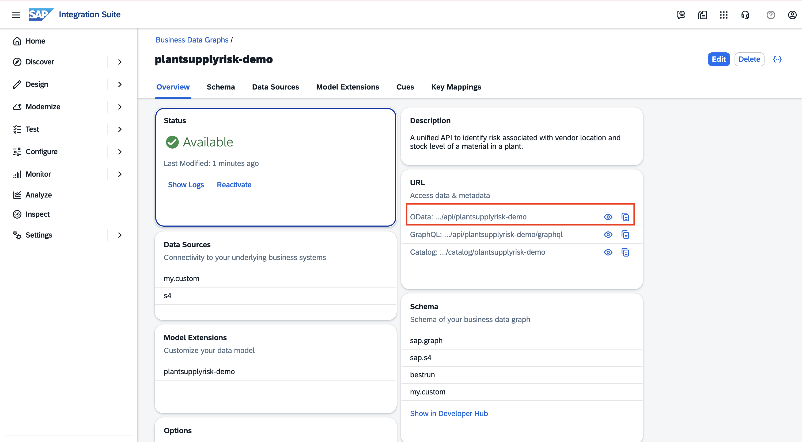

> [!NOTE]
> Copy the **OData URL** from the URL section on this page. This is the final URL to use in the MCP Server configuration in Exercise 2.

---

## Ex. 1.7 — Explore the Business Data Graph via API Composition Navigator

### Step 1 — Open the API Composition Navigator

Click the **grid icon (⠿)** icon in the top-right to open the navigation menu. Select **API Composition Navigator**.

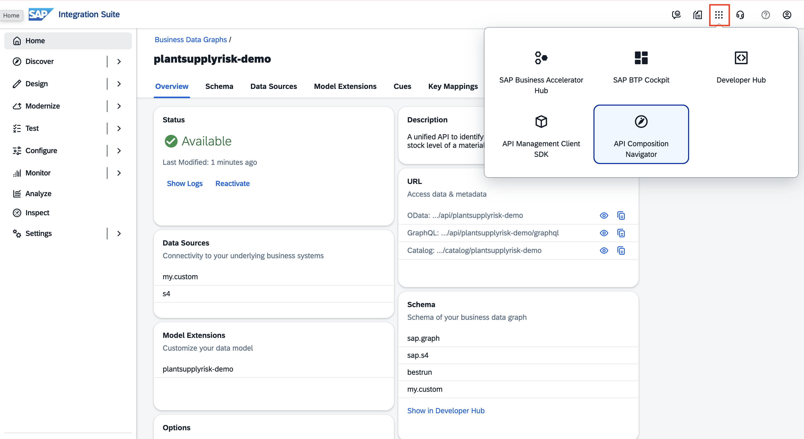

The **Developer Hub | API Composition** page opens, listing all available Business Data Graphs on the tenant.

Click on **`plantsupplyrisk-demo-XX`**.

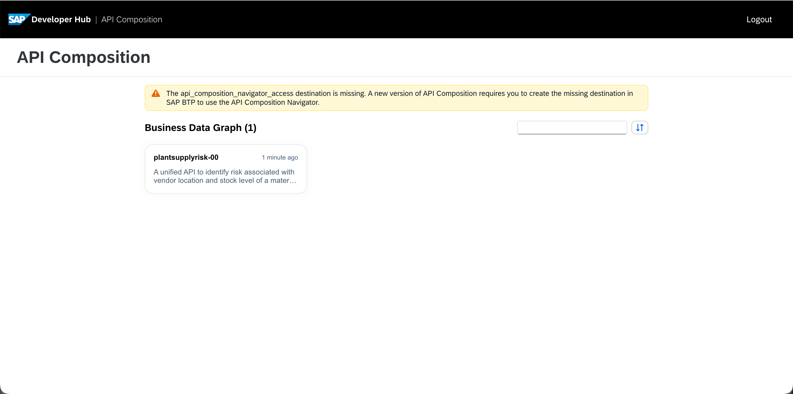

### Step 2 — Explore the Custom Entity

In the left panel, expand the **bestrun (1)** namespace and click on **assessment**.

The entity overview shows:

- **API Specification** — click **OpenAPI Specification** to download the spec file. Keep this for Exercise 2.
- **Source Entities** — `my.custom/Plant`, `my.custom/AddressRisk`, `sap.s4/A_MatlStkInAcctMod`
- **Connected Entities** — a visual graph showing `assessment` linked to `assessment_addressRisks` and `assessment_matlStkInAcctMods`

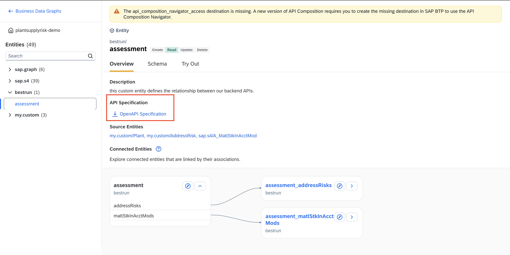

> [!NOTE]
> The **OpenAPI Specification** downloaded here is what you will use to register the Business Data Graph as an MCP tool in Exercise 2.

### Step 3 — Try Out the API

Click the **Try Out** tab on the `assessment` entity page.

The navigator pre-builds an OData query for you. Click **$expand** to select which navigation properties to include in the response — check both **`addressRisks`** and **`matlStkInAcctMods`**.

The query updates to:

```
/bestrun/assessment?$top=1&$expand=addressRisks,matlStkInAcctMods
```

Click **Run**.

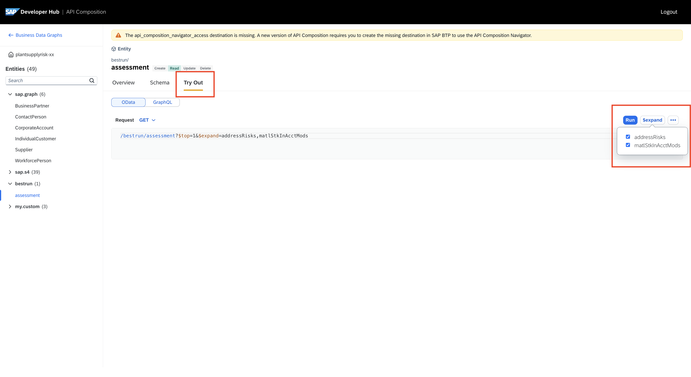

The response returns a `200 OK` with a live plant record. You can see the composed structure in action — a single response containing the plant (`id`, `plantName`), its expanded address risks (`addressRisks`) with risk details including `riskScope`, and its material stock records (`matlStkInAcctMods`) with stock quantity:

```json
{
  "@odata.context": "$metadata#assessment(addressRisks(),matlStkInAcctMods())",
  "value": [
    {
      "id": "my.custom~0010",
      "plantName": "Berlin",
      "addressRisks": [
        {
          "addressId": "4678045",
          "riskFactor": "ground transport interruption",
          "riskCategory": "low",
          "riskScore": "0.1",
          "riskTrend": "increasing",
          "riskScope": "local"
        }
      ],
      "matlStkInAcctMods": [
        {
          "material": "Brake Pad",
          "storageLocation": "0010",
          "batch": "612912",
          "supplier": "Windmill Components",
          "customer": "",
          "wbsElementInternalID": "",
          "sdDocument": "4",
          "sdDocumentItem": "5",
          "inventorySpecialStockType": "2",
          "inventoryStockType": "4",
          "matlWrhsStkQtyInMatlBaseUnit": 10
        }
      ]
    }
  ]
}
```

Use the **Navigate** panel on the right to drill into `…/addressRisks` or `…/matlStkInAcctMods` directly.

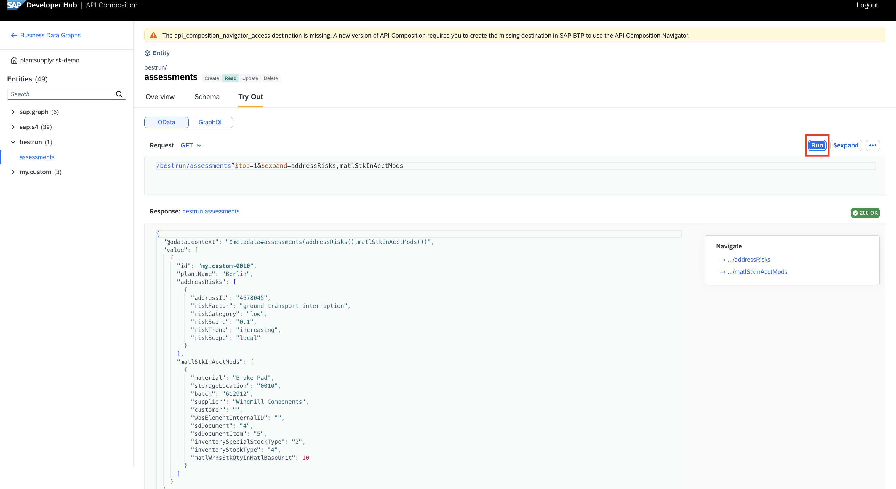

---

## Summary

In this exercise you:

- Created a **Business Data Graph** composing 4 backend destinations into a single unified API
- Activated the graph and retrieved the OData URL
- Created a **Model Extension** and defined a **Custom Entity** (`bestrun.assessment`) joining Plant, AddressRisk, and MaterialStock with cross-source navigation properties
- Connected the Model Extension back to the Business Data Graph and re-activated it to expose the custom entity
- Explored the Business Data Graph via the **API Composition Navigator**, confirmed entity relationships, and downloaded the **OpenAPI Specification**

This composed API is what powers the MCP Server in the core exercises — enabling the AI Agent to query supplier, plant, material, and risk data through a single endpoint.

---

Continue to [Exercise 2 — Create, Deploy & Consume an MCP Server](../ex2/README.md)

---

[Back to Overview](../../README.md)
