# Exercise 2 — Create, Deploy & Consume an MCP Server

## Overview

An AI agent is only as useful as the data it can reach. Getting it to enterprise data safely is the challenge.

In this exercise, you will wrap the Business Data Graph from Exercise 1 as an **MCP Server** — the standardized bridge between enterprise APIs and AI agents. You will deploy a MCP artifact, publish it as a product, and retrieve the OAuth credentials that authorize agent access.
By the end, your supply risk data is accessible to any MCP-compatible agent — secured, governed, and ready.

> For a deeper understanding of the MCP paradigm in SAP Integration Suite, refer to [API-Centric Integration in SAP Integration Suite: A New Paradigm for API & MCP](https://community.sap.com/t5/technology-blog-posts-by-sap/api-centric-integration-in-sap-integration-suite-a-new-paradigm-for-api-amp/ba-p/14438245)

---

> [!IMPORTANT]
> Add your participant number to the end of every artifact you create. Wherever you see `XX` in the steps below, replace it with your assigned number (e.g. participant `03` uses `plantsupplyrisk_03` for the MCP Server, `plantsupplyriskProduct-03` for the Product, and `plantsupplyriskSubscription-03` for the Subscription).

## Ex. 2.1 — Create an Integration Package

### Step 1 — Navigate to Integrations and APIs

In SAP Integration Suite, go to **Design → Integrations and APIs**.

You will see a list of existing Integration Packages on the tenant.

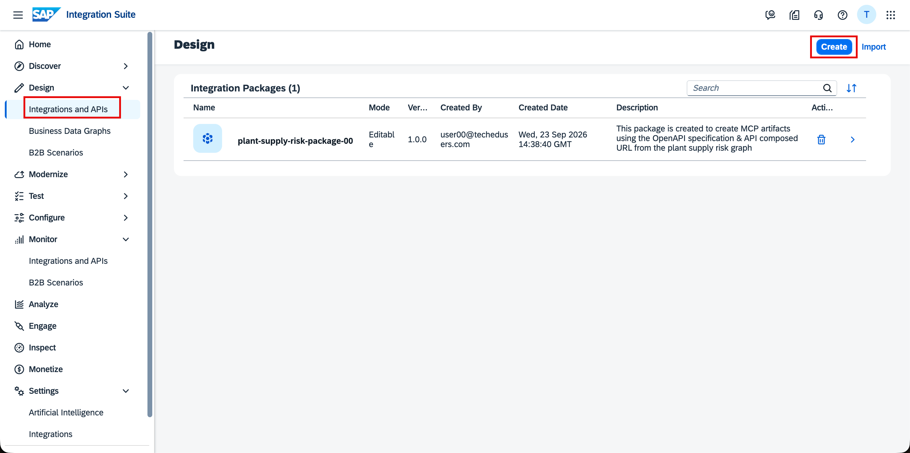

Click **Create**.

### Step 2 — Fill in Package Details

Fill in the package details:

| Field | Value |
|---|---|
| Name | `plant-supply-risk-packageXX`  |
| Technical Name | *(auto-populated)* |
| Short Description | `This package is created to create MCP artifacts using the OpenAPI specification & API composed URL from the plant supply risk graph.` |
| Version | `1.0` |

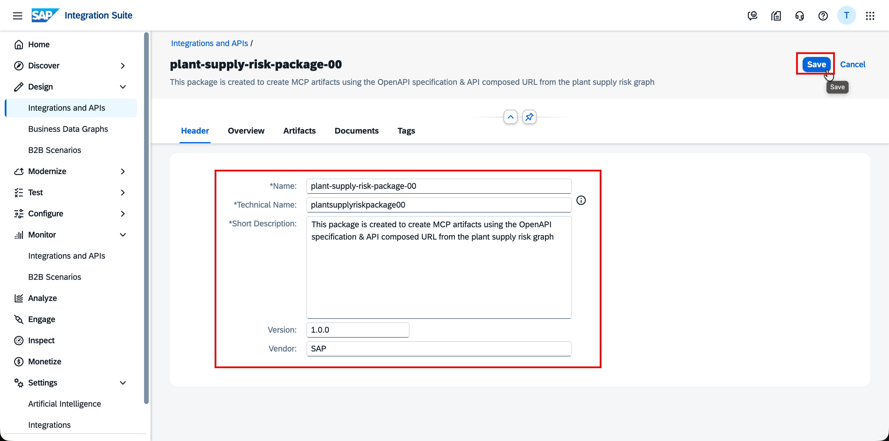

Click **Save**.

---

## Ex. 2.2 — Add an MCP Server

### Step 1 — Open the Artifacts Tab

After saving, you will land on the package detail page. Click the **Artifacts** tab.

Click **Add → MCP Server**.

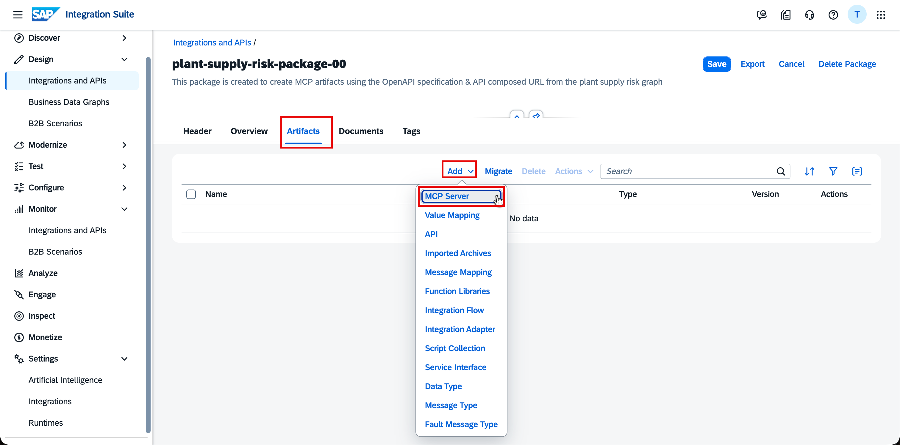

### Step 2 — Select Source Type

In the **Add MCP Server** wizard, select **HTTP Endpoint with OpenAPI Specification**.

> This option creates an MCP Server from any HTTP endpoint by providing the URL and importing the OpenAPI Specification.

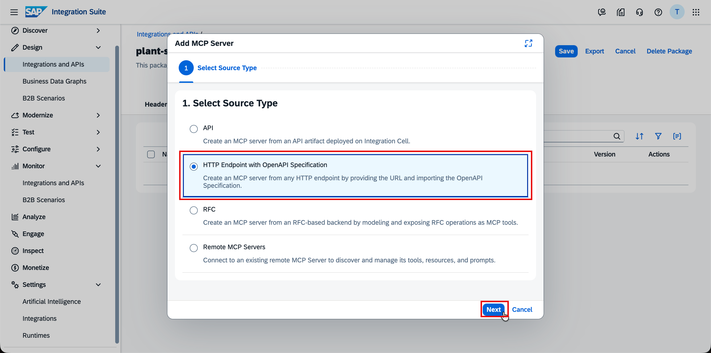

Click **Next**.

### Step 3 — Configure MCP Server Details

Fill in the MCP Server details:

| Field | Value |
|---|---|
| Method | `Upload` |
| File Name | Upload the **OpenAPI Specification** file downloaded from the API Composition Navigator in Ex. 1.7 |
| Source | `URL` |
| URL | The **OData URL** copied from the Business Data Graph Overview in Ex. 1.6 |
| Name | `plantsupplyrisk_XX` |
| ID | `plantsupplyrisk_XX` |
| MCP Path | `/mcp-plantsupplyrisk-XX` |
| Version | `1.0` |

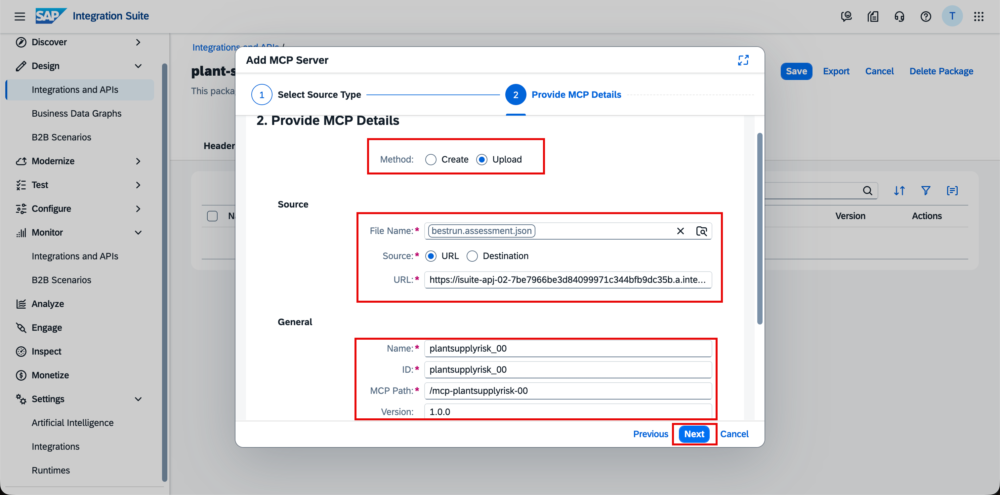

Click **Next**.

### Step 4 — Select Tools

The wizard reads your OpenAPI Specification and lists all available operations as **tools**. Select the tools you want to expose to the AI agent.

| Method | Path | Description | Select |
|---|---|---|---|
| GET | `/bestrun/assessment` | Retrieve a list of assessments | ✓ |
| GET | `/bestrun/assessment/{id}` | Retrieve a single assessment | ✓ |
| GET | `/bestrun/assessment/{id}/addressRisks` | Retrieve a list of address risks | ✓ |
| GET | `/bestrun/assessment/{id}/addressRisks/{addressId}...` | Retrieve a single address risk | ✓ |
| GET | `/bestrun/assessment/{id}/matlStkInAcctMods` | Retrieve a list of material stock records | |
| GET | `/bestrun/assessment/{id}/matlStkInAcctMods/{mat}...` | Retrieve a single material stock record | |

Click **Add**.

> [!NOTE]
> The four tools selected above expose the assessment and address risk operations — the operations most relevant to the supply risk use case. Practitioners should select tools based on what the AI agent actually needs to answer business questions.

---

## Ex. 2.3 — Review the Policy Model

From the MCP Server detail page, click the **Policies** tab.

### Default Processing Flow

When an MCP Server is created, SAP Integration Suite automatically applies a default processing template. This template provides the runtime flow required to receive, authenticate, authorize, and forward requests to the backend service.

| Component | Role |
|---|---|
| **MCP Sender Adapter** | Entry point — exposes the managed MCP endpoint and receives requests from AI agents |
| **Authentication** | Verifies the identity of the API consumer. Supports Basic Authentication, OAuth 2.0, Client Certificate, and External OAuth (OIDC) for token validation from external identity providers such as Microsoft Entra ID, Google, and Okta. Multiple methods can be enabled simultaneously. |
| **Authorization** | Determines whether the authenticated caller is permitted to invoke the API |
| **HTTP Receiver Adapter** | Forwards the request to the backend service and returns the response through the same pipeline |

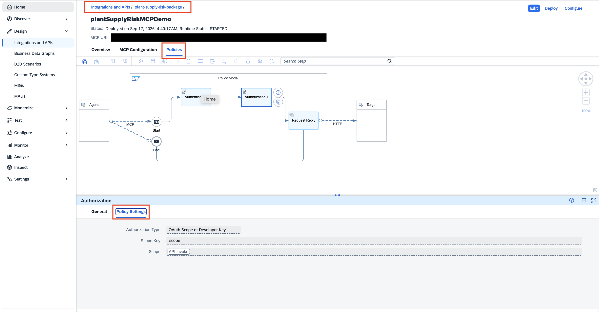

### Authorization Settings

Click the **Authorization 1** policy in the diagram. The **Policy Settings** tab shows:

| Setting | Value |
|---|---|
| Authorization Type | `OAuth Scope or Developer Key` |
| Scope Key | `scope` |
| Scope | `API.invoke` |

Access is granted if the caller presents either a valid OAuth scope (`API.invoke`) **or** a valid Developer Key. Other available modes include requiring both, OAuth scope only, or Developer Key only.

### Extending the Policy Flow

Beyond the defaults, additional policies can be added to the processing flow:

- **Security** — Request validation, threat protection, certificate pinning
- **Traffic Management** — Quota limits and Spike Arrest to protect backend systems from overload
- **Transformation & Mediation** — Payload modification, format conversion, JavaScript or Python scripts

For this workshop, the default configuration is sufficient. Return to the **Overview** tab and proceed to deployment.

> [!NOTE]
> **No action needed** — the default policy settings are pre-configured and ready to use. You do not need to modify any policy for this workshop.

---

## Ex. 2.4 — Deploy the MCP Server

### Step 1 — Click Deploy

From the MCP Server detail page, click **Deploy** in the top-right.

A confirmation dialog will appear:

| Field | Value |
|---|---|
| Runtime Profile | `Integration Cell` |
| Virtual Host | *(auto-populated based on your tenant)* |

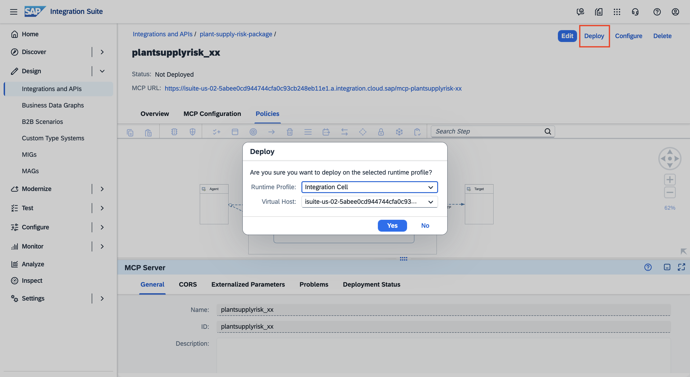

Click **Yes** to confirm.

### Step 2 — Verify Deployment Status

Wait for the status to update. When deployment completes successfully, the status bar will show:

**Deployed on \<date\>, Runtime Status: STARTED**

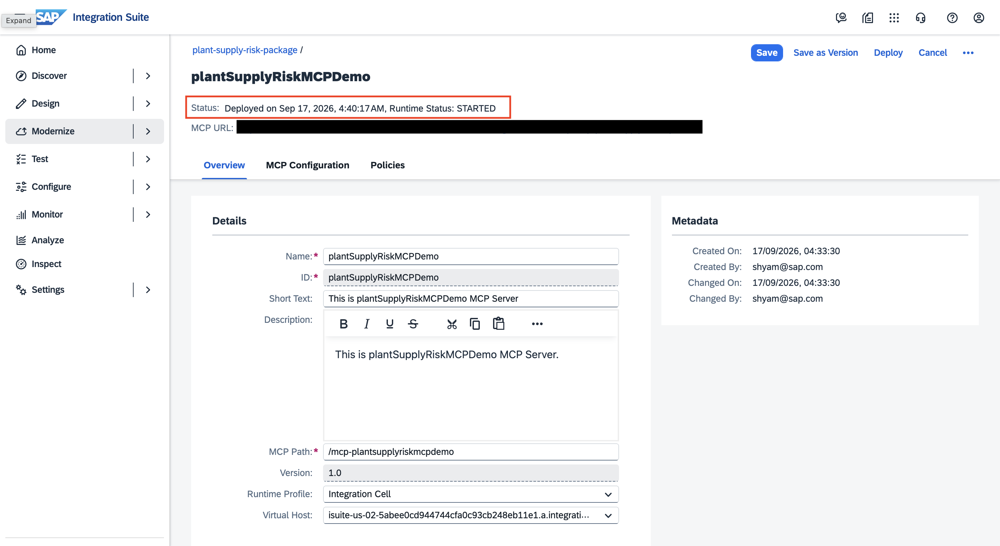

> [!NOTE]
> Note the **MCP URL** shown on this page — it follows the pattern `https://<virtual-host>/mcp-plantsupplyrisk-XX`. You will use this URL when connecting the agentic client in Ex. 2.8.

---

## Ex. 2.5 — Publish via Developer Hub

### Step 1 — Navigate to Developer Hub

From the MCP Server detail page, click the **grid icon (⠿)** in the top-right navigation bar.

In the menu that appears, click **Developer Hub**.

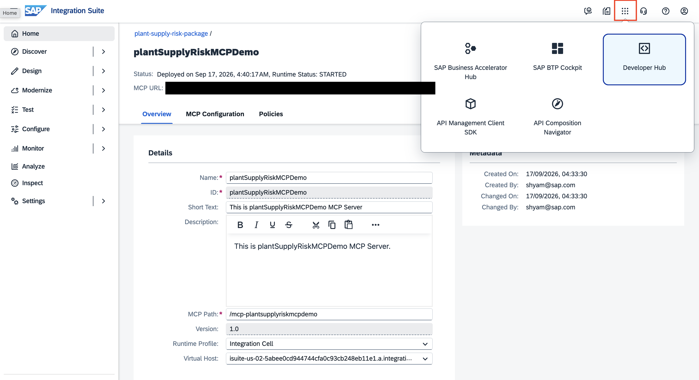

### Step 2 — Open Admin Center → Content

In the Developer Hub top navigation bar, click **Admin Center → Content**.

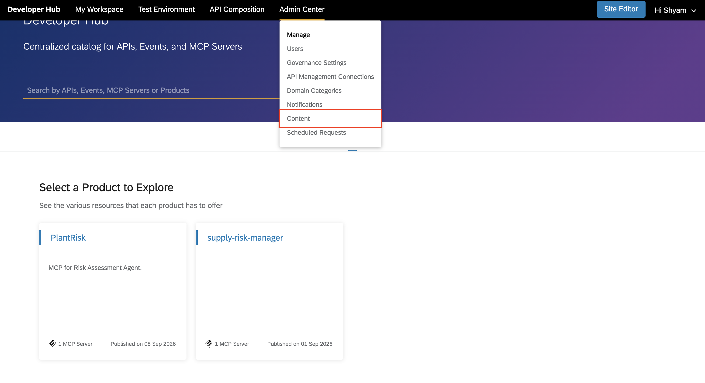

### Step 3 — Select Your Business System

On the **Manage Content** page, open the **Business Systems** tab.

Click on your Integration Suite business system to open it.

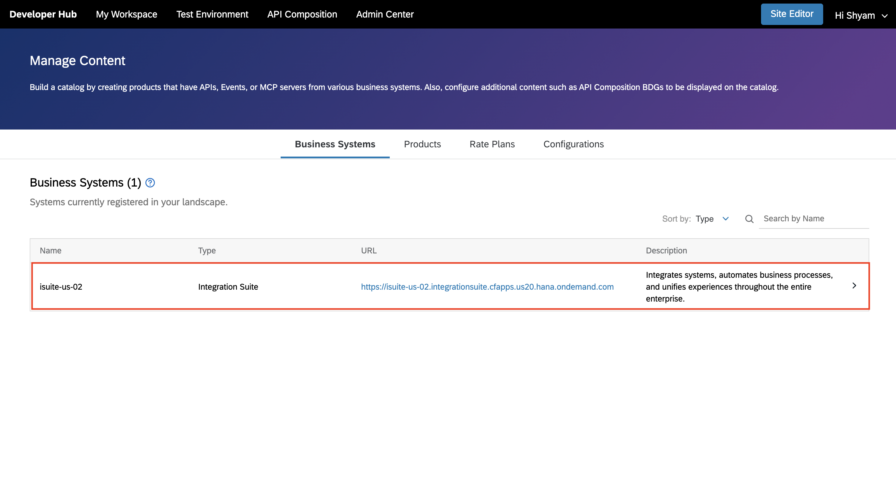

### Step 4 — Select the MCP Server

Click the **MCP Servers** tab. You will see a list of all deployed MCP Servers registered on this business system.

Select **`plantsupplyrisk_XX`** by checking the checkbox next to it.

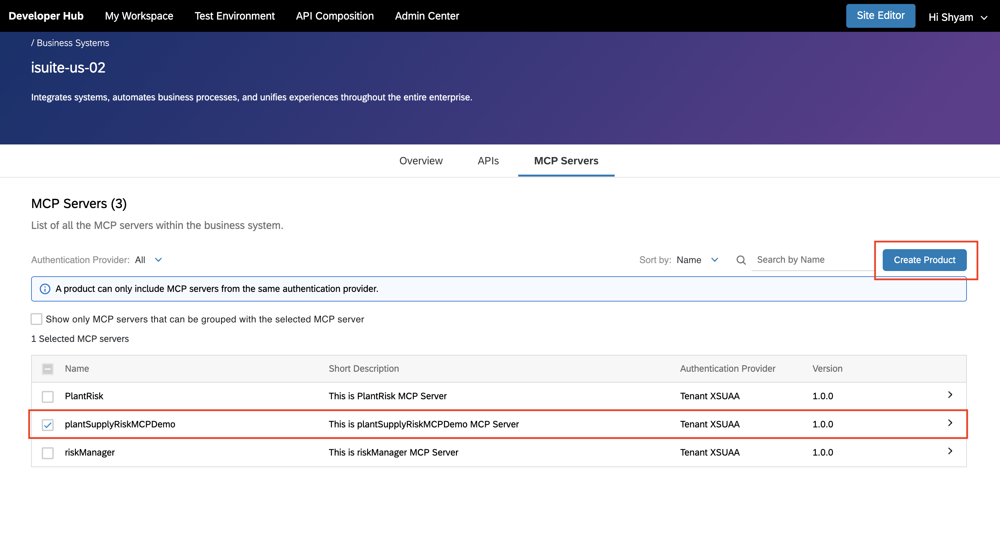

Click **Create Product**.

### Step 5 — Fill in Product Details and Publish

Fill in the product details:

| Field | Value |
|---|---|
| Name | `plantsupplyriskProduct-XX` |
| ID | `plantsupplyriskProduct-XX` |
| Short Text | *(optional)* |
| Description | `The Plant Supply Risk MCP Artifact is deployed as a product.` |

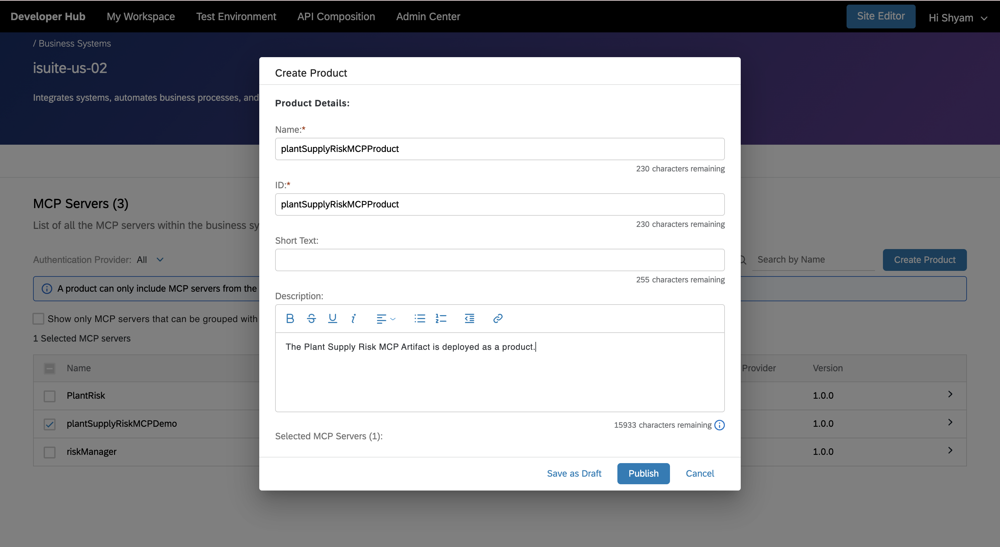

Click **Publish**.

> [!NOTE]
> Publishing triggers an AI-assisted content creation process in the background. You can optionally monitor its progress via **Admin Center → Scheduled Requests**. Wait for the status to change to **Success** before subscribing.
>
> 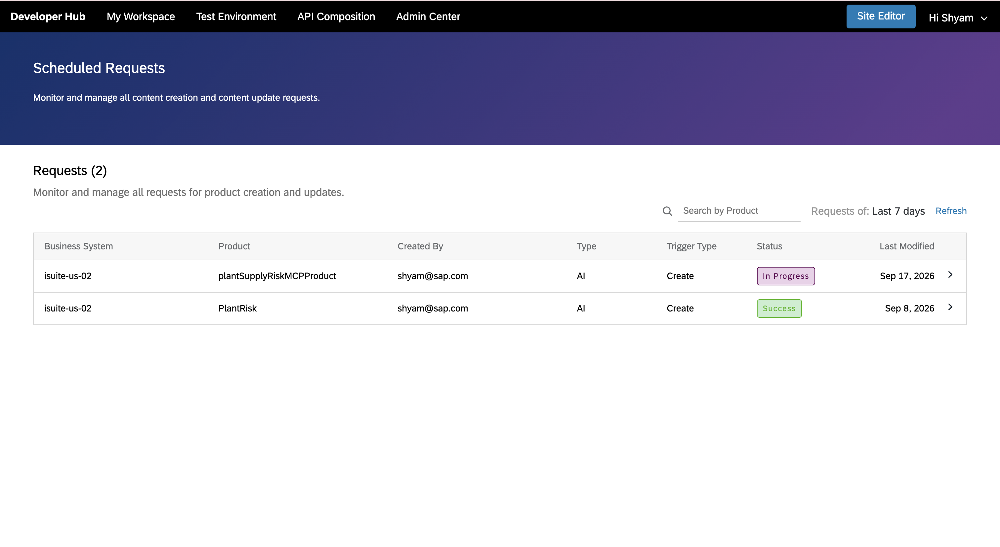

### Step 6 — Confirm the Product is Live

In the top navigation bar, click **Developer Hub** to return to the Developer Hub home page. Your product `plantsupplyriskProduct-XX` should appear in the catalog.

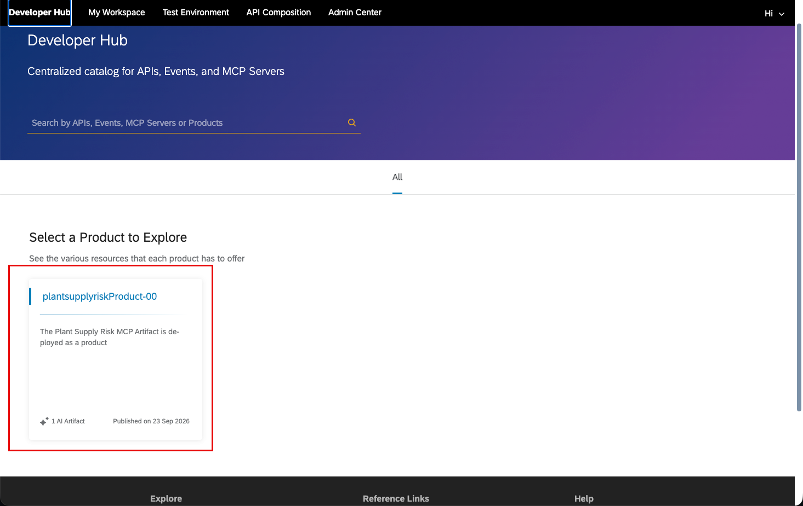

---

## Ex. 2.6 — Subscribe to the Product

### Step 1 — Open the Product and Subscribe

Click on **`plantsupplyriskProduct-XX`** from the Developer Hub catalog.

On the product detail page, click **Subscribe → Create New Subscription for Agent**.

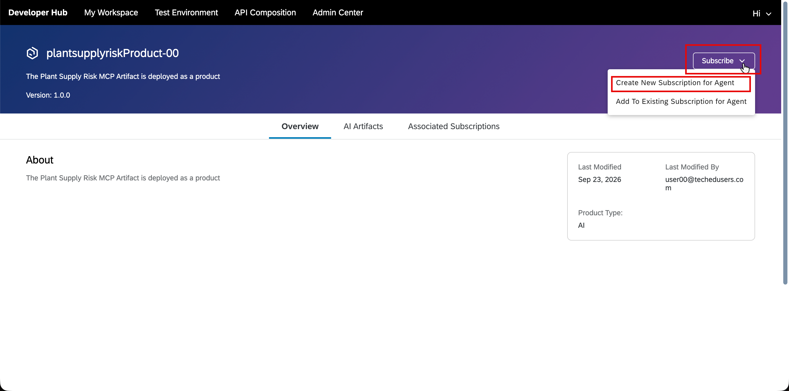

### Step 2 — Fill in Subscription Details

Fill in the subscription details:

| Field | Value |
|---|---|
| Product | `plantsupplyriskProduct-XX` *(pre-filled)* |
| Name | `plantsupplyriskSubscription-XX` |
| Short Text | *(optional)* |
| Description | `Plant supply risk MCP product is subscribed.` |

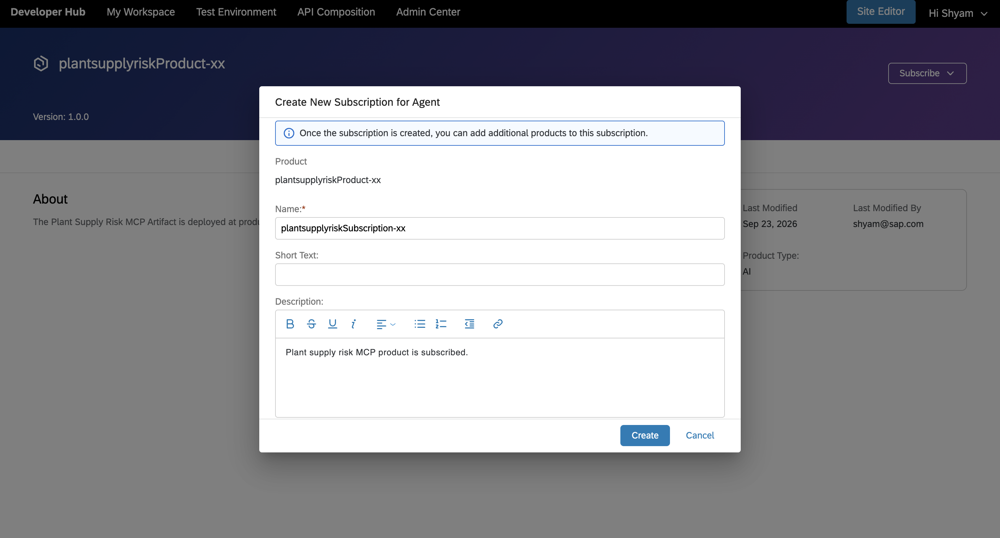

Click **Create**.

> [!NOTE]
> Subscription finalization may take a short while. The credentials will become available once provisioning is complete. Proceed to Ex. 2.7 once the subscription appears in **My Workspace → Subscriptions → Agents**.

---

## Ex. 2.7 — Retrieve Credentials

### Step 1 — Open My Workspace

In the Developer Hub top navigation bar, click **My Workspace**.

On the **Subscriptions** page, click the **Agents** tab. You will see your newly created subscription `plantsupplyriskSubscription-XX` in the list.

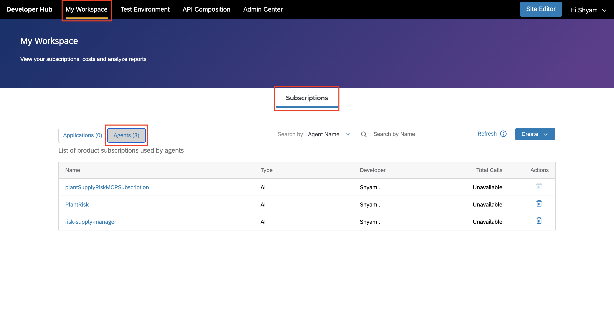

Click on **`plantsupplyriskSubscription-XX`** to open it.

### Step 2 — Copy Your Credentials

On the subscription **Overview** page, locate the **Credentials** section.

Copy and save the following — you will need all three in Ex. 2.8:

| Credential | What it is |
|---|---|
| **Token URL** | OAuth token endpoint to exchange your credentials for a bearer token |
| **Key** | OAuth Client ID |
| **Secret** | OAuth Client Secret |

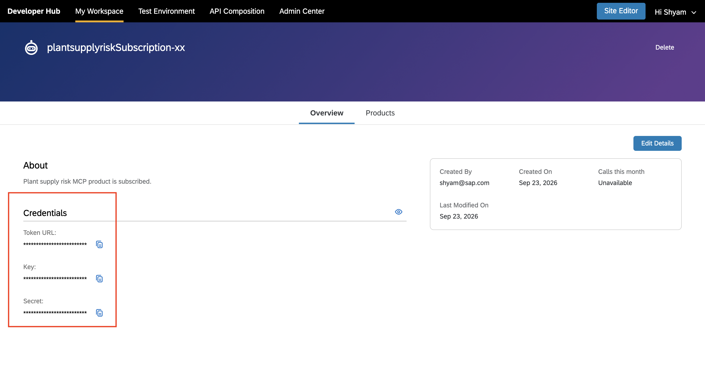

> [!NOTE]
> It may take a short while for the credentials to appear on the Overview page. If the Credentials section is not yet visible, refresh the page and try again.

---

## Ex. 2.8 — Test with an Agentic Client

The MCP Server can be consumed by any MCP-compatible agent. For this workshop, your instructor will provide a hosted **MCP Inspector** URL — open it in your browser.

### Step 1 — Add Your MCP Server

In MCP Inspector, click **Add Servers → HTTP** and fill in the following:

| Field | Value |
|---|---|
| Server ID | `plantsupplyrisk_XX` |
| Transport | `streamable-http` |
| URL | Your MCP URL from Ex. 2.4 (e.g. `https://<virtual-host>/mcp-plantsupplyrisk-XX`) |

Click **Save**.

### Step 2 — Get a Bearer Token

SAP Integration Suite uses OAuth 2.0 Client Credentials. Use any API client (Bruno, Postman, curl, etc.) to request a token.

Make a `POST` request with **Form URL Encoded** body:

| Field | Value |
|---|---|
| URL | Your **Token URL** from Ex. 2.7 |
| `grant_type` | `client_credentials` |
| `client_id` | Your **Key** from Ex. 2.7 |
| `client_secret` | Your **Secret** from Ex. 2.7 |

A `200 OK` response returns an `access_token`. Copy it.

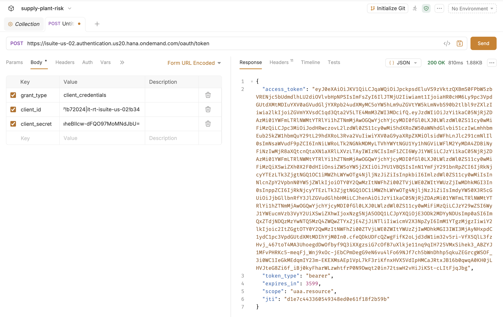

### Step 3 — Add the Token to MCP Inspector

On the server card, click **Settings** → scroll to **Custom Headers** → expand and add:

| Key | Value |
|---|---|
| `Authorization` | `Bearer <paste your access_token here>` |

Scroll to **OAuth Settings** → ensure **Enterprise-managed authorization** is unchecked.

Close Settings → toggle the server switch to **Connected**.

### Step 4 — Explore and Test Tools

Once connected, click **Settings** on the server card → open the **Tools** tab.

You will see the 4 operations exposed from your OpenAPI spec. Start with:

1. Click **Retrieve a list of assessment** (`get_bestrun_assessment`)
2. No parameters needed — click **Run Tool**
3. The response lists all plants with their IDs (Berlin, Munich, London, etc.)

Pick any `id` from the results and run **Retrieve a list of address risks** (`get_bestrun_assessment_id_addressRisks`) — this returns the live risk scores for that plant's location.

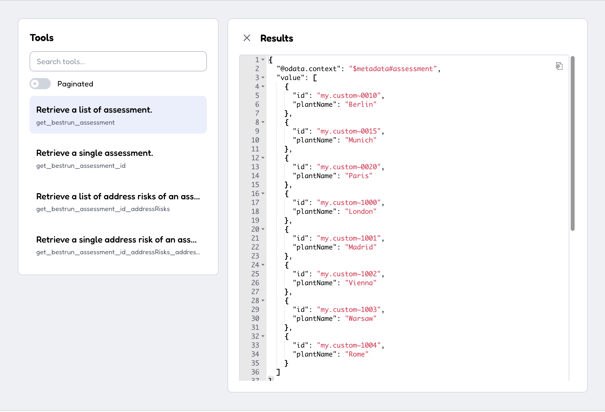

> **Tip:** The data you see here — plant IDs, risk factors, risk scores — is exactly what an AI agent will receive when it calls these tools autonomously to answer a procurement question.

### Troubleshooting

| Issue | Fix |
|---|---|
| Cannot connect | Verify the MCP URL matches the one shown in Ex. 2.4 |
| 401 Unauthorized | Re-generate a fresh token — tokens expire after ~3600 seconds |
| No tools listed | Ensure the correct tools were selected during Ex. 2.2 Step 4 |
| Issuer mismatch error | Do not use Enterprise-managed authorization — use Custom Headers with Bearer token instead |

---

## Summary

In this exercise you:

- Created an **Integration Package** and added an **MCP Server** backed by the Business Data Graph OpenAPI Specification from Exercise 1
- Reviewed the default **Policy Model** — MCP Sender Adapter, Authentication, Authorization (`API.invoke`), and HTTP Receiver Adapter
- Deployed the MCP Server to **Integration Cell**, making the assessment tools available as a live endpoint
- Published the MCP Server as a **product** (`plantsupplyriskProduct-XX`) in the Developer Hub
- Subscribed to the product (`plantsupplyriskSubscription-XX`) and retrieved the **OAuth credentials** (Token URL, Key, Secret) needed by AI agents
- Tested the MCP Server tools using the **agentic client** (MCP Inspector)

The MCP Server is now ready to be consumed by any MCP-compatible AI agent.

---

[Back to Overview](../../README.md)
