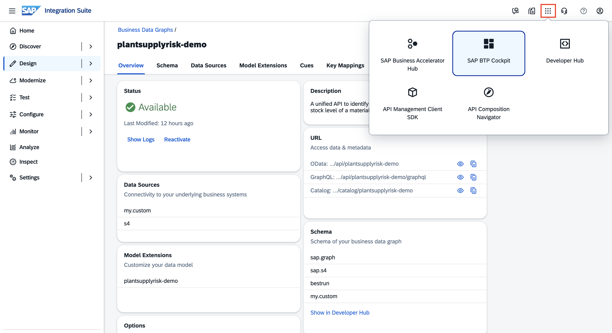
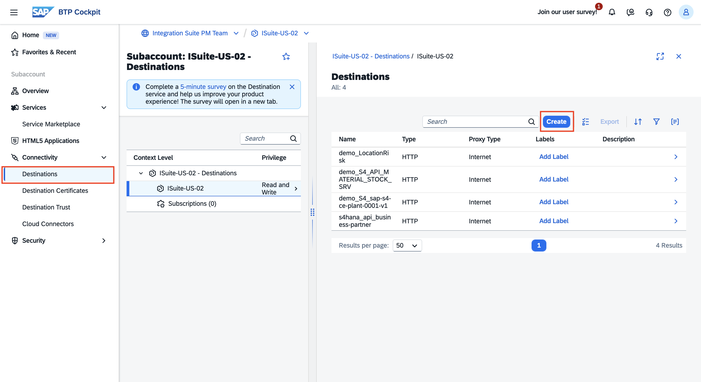
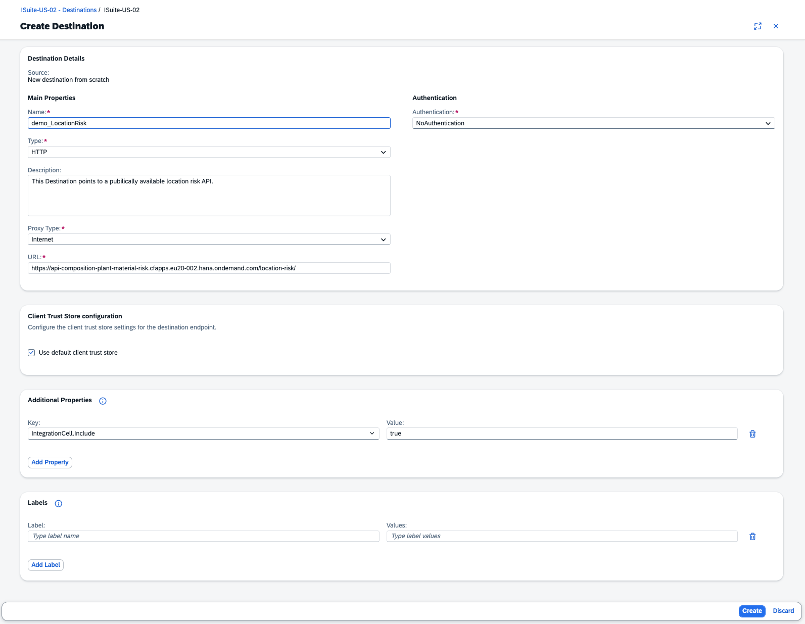

# API Composition Tenant Setup

> **Note:** The following setup has been pre-configured by the session instructors. No action is required from participants.

---

## Prerequisites

- An SAP BTP subaccount in the Cloud Foundry environment with Cloud Foundry enabled
- **SAP Integration Suite** entitled, subscribed, and the `Integration_Provisioner` role collection assigned
- **API Composition** activated on the SAP Integration Suite home page and `Graph.KeyUser` role collection assigned

For reference on how the tenant was set up, see:

- [Check BTP regions where the API Composition capability is available](https://me.sap.com/notes/3338820)
- [Create an SAP BTP Trial Account](https://developers.sap.com/tutorials/hcp-create-trial-account.html)
- [Set up SAP Integration Suite on Trial](https://developers.sap.com/tutorials/cp-starter-isuite-onboard-subscribe.html)
- [Activate API Composition on SAP Integration Suite](https://help.sap.com/docs/api-composition/isuite-api-composition/initial-setup?locale=en-US#2.-activate-api-composition-on-sap-integration-suite)

Refer to the [API Composition Initial Setup](https://help.sap.com/docs/api-composition/isuite-api-composition/initial-setup) guide for full details.

---

## Destinations

The Business Data Graph in this workshop composes data from four backend systems — location risk, material stock, plant details, and business partner (supplier) data. To make these systems accessible to SAP Integration Suite, four HTTP destinations are configured in the SAP BTP subaccount. Each destination points to one of the publicly hosted mock APIs provided for this workshop.

| Destination | Path | Represents |
| :--- | :--- | :--- |
| `demo_LocationRisk` | `/location-risk` | Location risk data (Everstream mock) |
| `demo_S4_API_MATERIAL_STOCK_SRV` | `/material-stock` | Material stock levels (S/4HANA mock) |
| `demo_S4_sap-s4-ce-plant-0001-v1` | `/plant` | Plant details (S/4HANA mock) |
| `s4hana_api_business-partner` | `/business-partner` | Supplier / Business Partner data |

All four mock APIs are hosted at `https://api-composition-plant-material-risk.cfapps.eu20-002.hana.ondemand.com` and are publicly accessible — no authentication is required.

Destinations are managed in the SAP BTP Cockpit. To navigate there from SAP Integration Suite, click the **grid icon (⠿)** in the top-right navigation bar and select **SAP BTP Cockpit**.

In the BTP Cockpit, go to your subaccount and navigate to **Connectivity → Destinations** in the left sidebar. All four destinations are listed here and are ready for use.

Each destination is created with the following configuration. The `Type` is set to **HTTP** and `Proxy Type` to **Internet** since these are external mock APIs. Authentication is set to **NoAuthentication** as the mock APIs are publicly accessible.

| Field | Value |
| :--- | :--- |
| Name | *(destination name from the table above)* |
| Type | **`HTTP`** |
| Proxy Type | **`Internet`** |
| URL | *(corresponding mock API URL)* |
| Authentication | **`NoAuthentication`** |

An additional property is added to each destination to make it visible within the Integration Cell runtime. Without this property, the destination will not appear as an available data source when configuring the Business Data Graph.

| Key | Value |
| :--- | :--- |
| `IntegrationCell.Include` | **`true`** |

The screenshot below shows the completed destination form for `demo_LocationRisk` as a reference example. The same structure is applied to all four destinations, with the respective name and URL substituted.

